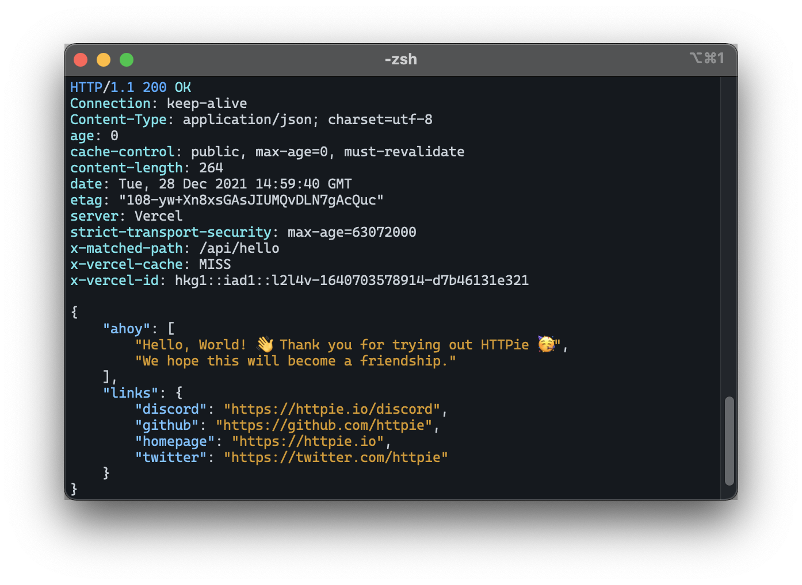
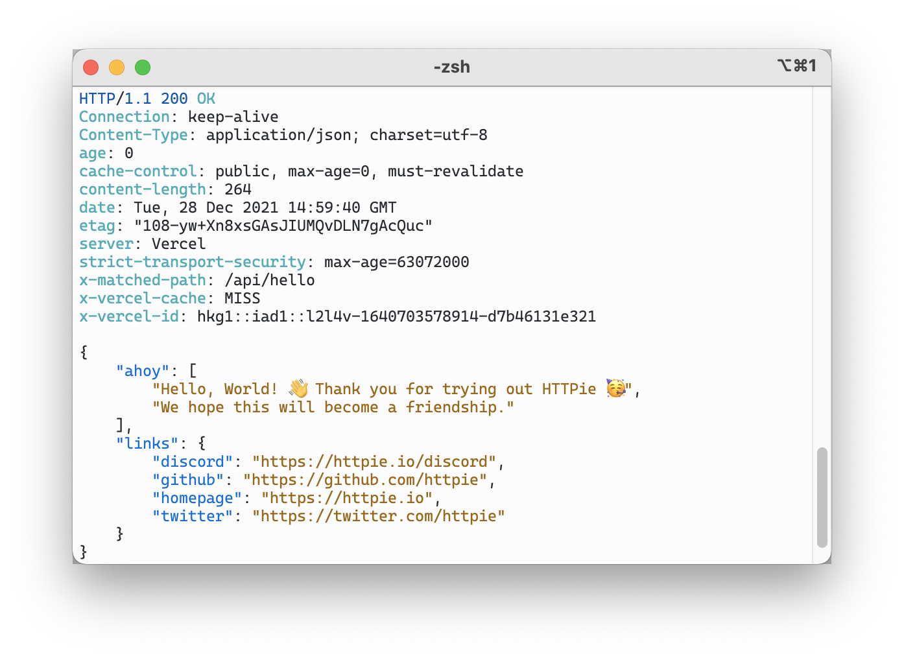

# GitHub theme for iTerm2

Some tips of funny settings:

Profiles -> Window -> Window Appearance:

Transparency: `20`

Blur: `16`

Profiles -> Text:

Use thin strokes for anti-aliased text: `Never`

Font -> Line spacing: `102` (default: `100`)

Profiles -> Terminal -> Scrollback Buffer:

Scrollback lines: `Unlimited scrollback`

## Dark theme

## Light theme

